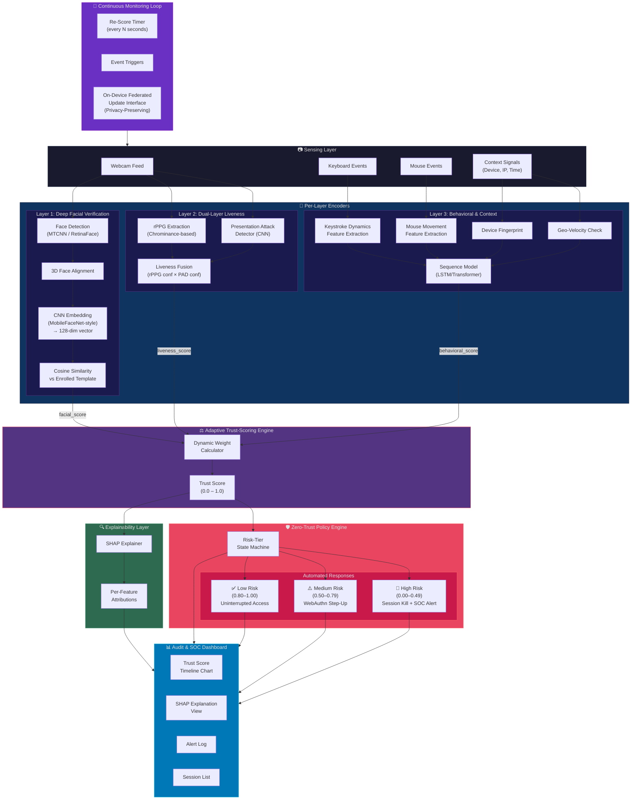

# AdaptiAuth — System Architecture

## High-Level Block Diagram



## Data Flow Summary

```
Webcam Frame ─────────┬──→ Face Detect → Align → Embed → Cosine Sim ─────→ facial_score
                      ├──→ rPPG Extraction ──────────────┐
                      └──→ PAD CNN ──────────────────────┤→ Liveness Fusion → liveness_score
                                                         │
Keyboard Events ──→ Keystroke Feature Extraction ────────┐
Mouse Events ─────→ Mouse Feature Extraction ────────────┤
Device/IP/Time ───→ Context Features ────────────────────┤→ Sequence Model → behavioral_score
                                                         │
                         ┌───────────────────────────────┘
                         ▼
              ┌─────────────────────┐
              │   Trust Fusion      │       ┌──────────────┐
              │   Engine            │──────→│ SHAP         │──→ Per-Feature Attributions
              │   (Dynamic Weights) │       │ Explainer    │       ↓
              │   → Trust Score     │       └──────────────┘   Dashboard
              └────────┬────────────┘
                       │
                       ▼
              ┌─────────────────────┐
              │  Policy Engine      │
              │  (State Machine)    │
              ├─────────────────────┤
              │ ≥0.80 → Allow       │
              │ 0.50–0.79 → Step-Up │
              │ <0.50 → Kill + Alert│
              └─────────────────────┘
                       │
            ┌──────────┼──────────┐
            ▼          ▼          ▼
         Allow     WebAuthn    SOC Alert
                   Challenge   + Session
                               Termination
```

## Component Boundaries

Each component is designed with clean module boundaries so they can be independently tested, swapped, or upgraded:

| Component | Module Path | Input | Output |
|-----------|-------------|-------|--------|
| Face Detection & Alignment | `ml/facial/alignment.py` | Raw frame (BGR) | Aligned face crop (112×112) |
| Facial Embedding | `ml/facial/embedding.py` | Aligned face crop | 128-dim float vector |
| Face Matching | `ml/facial/matching.py` | Embedding + enrolled template | Cosine similarity score (0–1) |
| rPPG Extraction | `ml/liveness/rppg.py` | Sequence of frames + face ROIs | Pulse signal + confidence |
| Presentation Attack Detector | `ml/liveness/pad.py` | Single frame (face crop) | Spoof probability (0–1) |
| Liveness Fusion | `ml/liveness/fusion.py` | rPPG confidence + PAD probability | Liveness sub-score (0–1) |
| Keystroke Feature Extractor | `ml/behavioral/keystroke.py` | Raw keystroke event stream | Feature vector |
| Mouse Feature Extractor | `ml/behavioral/mouse.py` | Raw mouse event stream | Feature vector |
| Context Feature Extractor | `ml/behavioral/context.py` | Device/IP/time metadata | Feature vector |
| Behavioral Sequence Model | `ml/behavioral/model.py` | Combined feature vectors over time | Behavioral consistency score (0–1) |
| Trust Fusion Engine | `ml/fusion/engine.py` | 3 layer scores + confidences | Trust Score (0–1) + weights used |
| SHAP Explainer | `ml/explainability/shap_explainer.py` | Trust fusion inputs/outputs | Per-feature attributions |
| Policy Engine | `backend/app/services/policy_engine.py` | Trust Score | Risk tier + action |
| Session Manager | `backend/app/services/session.py` | Session events | Session state |
| WebAuthn Step-Up | `backend/app/services/webauthn.py` | Step-up trigger | Challenge/response flow |

## Database Schema (SQLite Prototype)

```sql
-- User enrollment
CREATE TABLE users (
    id TEXT PRIMARY KEY,
    username TEXT UNIQUE NOT NULL,
    facial_template BLOB,          -- Enrolled 128-dim embedding
    behavioral_baseline BLOB,      -- Serialized baseline model
    created_at TIMESTAMP DEFAULT CURRENT_TIMESTAMP
);

-- Active sessions
CREATE TABLE sessions (
    id TEXT PRIMARY KEY,
    user_id TEXT REFERENCES users(id),
    trust_score REAL DEFAULT 1.0,
    risk_tier TEXT DEFAULT 'low',   -- low | medium | high
    status TEXT DEFAULT 'active',   -- active | step_up | terminated
    created_at TIMESTAMP DEFAULT CURRENT_TIMESTAMP,
    updated_at TIMESTAMP DEFAULT CURRENT_TIMESTAMP
);

-- Trust score history (for dashboard timeline)
CREATE TABLE trust_events (
    id INTEGER PRIMARY KEY AUTOINCREMENT,
    session_id TEXT REFERENCES sessions(id),
    trust_score REAL NOT NULL,
    facial_score REAL,
    liveness_score REAL,
    behavioral_score REAL,
    shap_attributions TEXT,         -- JSON blob
    risk_tier TEXT,
    policy_action TEXT,
    timestamp TIMESTAMP DEFAULT CURRENT_TIMESTAMP
);

-- SOC alerts
CREATE TABLE alerts (
    id INTEGER PRIMARY KEY AUTOINCREMENT,
    session_id TEXT REFERENCES sessions(id),
    alert_type TEXT NOT NULL,       -- step_up_required | session_terminated
    details TEXT,                   -- JSON blob with context
    acknowledged BOOLEAN DEFAULT FALSE,
    created_at TIMESTAMP DEFAULT CURRENT_TIMESTAMP
);

-- WebAuthn credentials (for step-up)
CREATE TABLE webauthn_credentials (
    id TEXT PRIMARY KEY,
    user_id TEXT REFERENCES users(id),
    credential_id BLOB NOT NULL,
    public_key BLOB NOT NULL,
    sign_count INTEGER DEFAULT 0,
    created_at TIMESTAMP DEFAULT CURRENT_TIMESTAMP
);
```

## Security-Relevant Simplifications (Prototype)

> [!CAUTION]
> The following are deliberate prototype simplifications that must be addressed before any production deployment:

1. **Anti-spoofing model**: Stubbed with a placeholder CNN — not trained on a real presentation-attack dataset
2. **rPPG pipeline**: Uses a well-established algorithm but has not been validated against sophisticated attacks
3. **WebAuthn**: Running in demo/attestation-none mode — no hardware-backed attestation verification
4. **SQLite**: Not suitable for concurrent production workloads — swap for PostgreSQL
5. **Federated learning**: Interface-only stub — no actual on-device training implementation
6. **Session tokens**: Simplified JWT — not using hardware-bound session keys
7. **TLS**: Not enforced in development — all production traffic must use HTTPS
